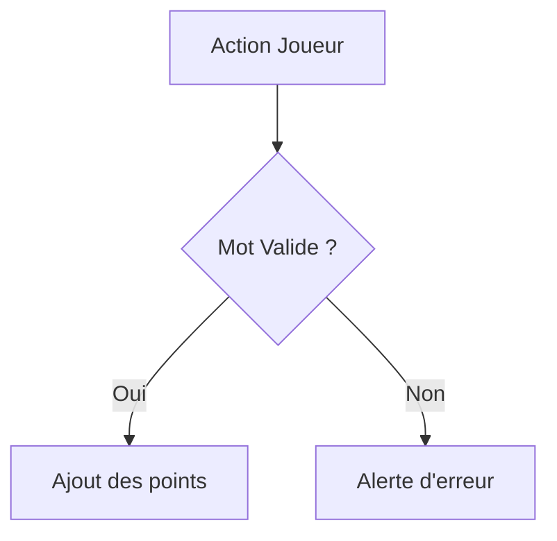

# Générateur de Documentation pour ScarbelleIA

Lorsque l'utilisateur vous demande de documenter une classe ou un composant (ex: `GameManager`, `Dawg`), suivez rigoureusement ces étapes :

## 1. Analyse
- Lisez le code source de la classe concernée et de ses dépendances directes.
- Identifiez les structures de données clés et les algorithmes principaux.
- Vérifiez s'il s'agit du `Model` (Logique) ou de la `View` (Interface graphique Swing).

## 2. Rédaction au format Markdown
Produisez un fichier Markdown qui contient les sections suivantes :
- **Description** : À quoi sert cette classe dans le jeu de Scrabble.
- **Rôle (MVC)** : Est-ce une classe de Vue ou de Modèle ?
- **Méthodes Clés** : Liste des méthodes importantes avec une explication claire.

## 3. Utilisation obligatoire de Mermaid.js
Vous devez impérativement inclure un schéma Mermaid dans la documentation :
- S'il s'agit d'une classe structurelle, faites un diagramme de classe (`classDiagram`).
- S'il s'agit d'un flux d'exécution complexe (ex: validation d'un mot), faites un diagramme de séquence (`sequenceDiagram`) ou un organigramme (`graph TD`).

**Exemple de format Mermaid attendu :**

## 4. Emplacement de la documentation
Toute documentation générée doit être enregistrée dans le dossier `docs/` à la racine du projet. Nommez le fichier de manière explicite (ex: `docs/GameManager_doc.md`).
