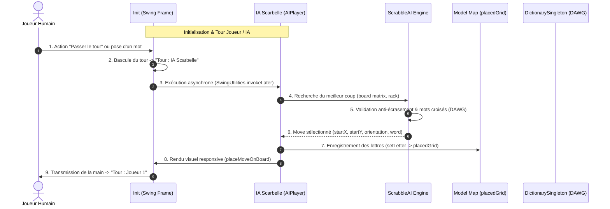

# Architecture Globale & Règles de Validation de ScarbelleIA

ScarbelleIA intègre une mise en page Swing moderne proposant un **Tableau de Bord Latéral (Scoreboard Panel)** à droite (`EAST`), un **Plateau de Jeu 15x15 Centré (Board Grid Wrapper)** et un moteur de tour autonome garantissant l'initiative et la réactivité de l'IA en mode PVE.

---

## 1. Schéma d'Architecture & Flux de Tour Automatisé (PVE)

---

## 2. Règles de Validation Algorithmique (`ScrabbleAI.java`)

3. **Correction de la Cartographie & Sécurisation des Bornes (`Anchor(row, col)` & `calculateScore`)** :
   - Les ancrages utilisent dorénavant une structure `Anchor(row, col)` unifiée afin d'éliminer toute inversion entre lignes et colonnes lors des recherches horizontales et verticales.
   - **Sécurisation anti-dépassement (`ArrayIndexOutOfBoundsException`)** : Les méthodes `calculateScore` et `searchMovesForAnchor` vérifient rigoureusement les bornes de la grille ($0 \le r, c < 15$), éliminant tout crash d'index 15.
   - Les mots sont recherchés avec des décalages d'alignement (`offset` de $0$ à $L-1$) permettant à l'IA de jouer sans jamais s'arrêter après plusieurs passes.

4. **Bouton Rejouer la Partie (`ScoreboardPanel`)** :
   - Intégration du bouton `🔁 Rejouer la partie` dans le tableau de bord latéral pour réinitialiser la partie à tout moment.
   - **Mots Croisés Perpendiculaires** : Chaque nouvelle tuile posée à côté d'une tuile existante valide la séquence perpendiculaire dans le DAWG. Si une seule séquence est invalide, le coup est **annulé**.

3. **Persistance de la Matrice du Plateau (`Map.java`)** :
   - `placedGrid` conserve l'état exact du jeu au fil des tours. `get_matrix()` transmet cette grille réelle à l'IA.

---

## 3. Organisation des Packages & Design Patterns

### `View` (Interface Graphique Swing)
- **`View/Screens/Init.java`** : Gère la fenêtre de jeu, l'initiative initiale de l'IA et le déclenchement automatique des tours IA lors des passes/actions.
- **`View/Components/ScoreboardPanel.java`** : Sidebar verticale (`BoxLayout.Y_AXIS`) affichant les scores, l'état du sac et les commandes du joueur (Pattern Observer via `GameStateObserver`).
- **`View/Main.java`** : Composants d'affichage des tuiles et chevalets.

### `Model` (Logique Métier & IA)
- **`Model/AI/`** : `ScrabbleAI.java`, `AIStrategy.java`, `ParallelDAWGStrategy.java` (Patterns Strategy & Builder).
- **`Model/Board/`** : `Cell.java`, `Map.java` (Matrice persistance 15x15 `placedGrid`).
- **`Model/Dictionary/`** : `Dawg.java`, `DictionarySingleton.java` (Pattern Singleton).
- **`Model/Enum/`** : `GameMode.java`.
- **`Model/Player/`** : `Player.java`, `HumanPlayer.java`, `AIPlayer.java` (Héritage & Polymorphisme).
