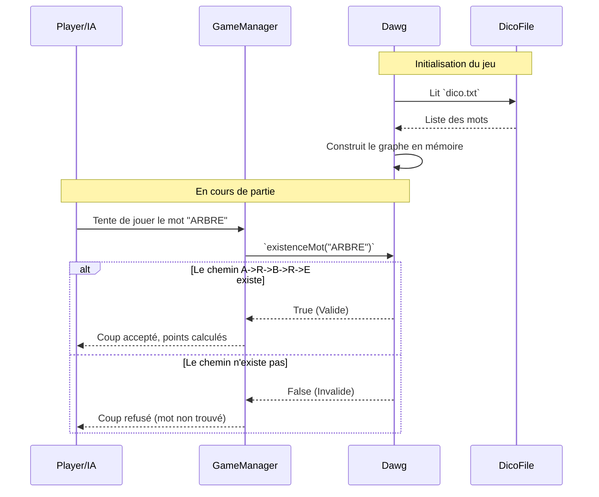

# Structure du Dictionnaire : DAWG (Directed Acyclic Word Graph)

Dans ScarbelleIA, la validation des mots est une opération critique qui doit être extrêmement rapide, surtout lors du calcul des coups d'une IA ou de la validation d'un coup joueur. Pour cela, le projet utilise un **DAWG**.

## Qu'est-ce qu'un DAWG ?

Un **Directed Acyclic Word Graph** (Graphe de mots acyclique orienté) est une structure de données optimisée qui permet de stocker un dictionnaire entier (comme `dico.txt`) avec une empreinte mémoire très faible tout en garantissant un temps de recherche ultra-rapide (complexité $O(L)$ où $L$ est la longueur du mot).

Contrairement à un arbre classique (Trie), le DAWG fusionne les suffixes communs. Par exemple, les mots `MANGER` et `BOUGER` partageront les mêmes nœuds pour la terminaison `GER`.

## Diagramme Fonctionnel

Voici comment le DAWG est utilisé par l'IA et le moteur du jeu pour valider ou trouver des mots.



## Structure Interne d'un Noeud DAWG

Chaque lettre est représentée par un Nœud.
- Un Nœud contient des "arêtes" (liens) vers ses Nœuds enfants (les lettres suivantes possibles).
- Un booléen `isEndOfWord` indique si le chemin parcouru jusqu'à ce Nœud forme un mot complet et valide du dictionnaire.

```mermaid
graph TD
    Root((Racine)) --> A(A)
    Root --> B(B)
    A --> R(R)
    R --> B2(B)
    B2 --> R2(R)
    R2 --> E((E*))
    
    B --> O(O)
    O --> U(U)
    U --> G(G)
    G --> E2(E)
    E2 --> R3((R*))

    Note right of E: L'étoile (*) indique la fin d'un mot valide.
```

## Utilisation pour l'IA

Pour l'IA "maison" de Scarbelle, le DAWG ne sert pas qu'à valider. Il permet de **générer** des coups. L'algorithme part d'une case d'ancrage sur le plateau, et "marche" dans le DAWG en utilisant exclusivement les lettres disponibles dans la main de l'IA. Si l'IA atteint un nœud `isEndOfWord`, elle a trouvé un coup jouable.
